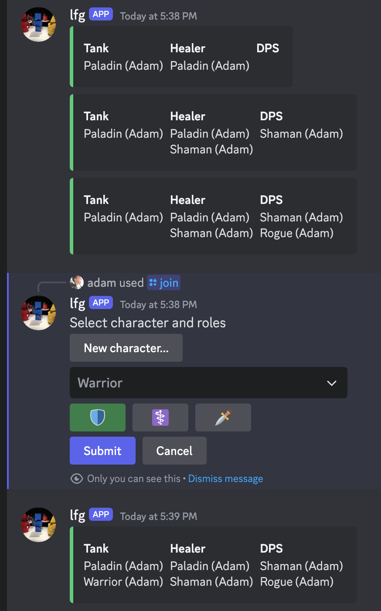
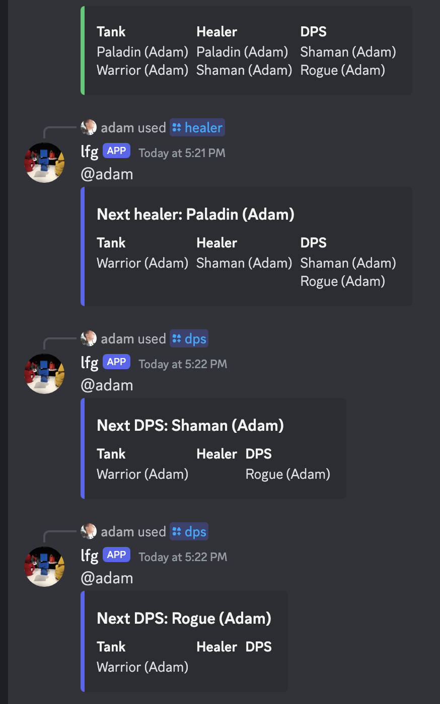

# lfg

Discord bot that facilitates out of game "looking for group" in Python using [pycord](https://pycord.dev).

## Features

- Each discord voice chat can have it's own group.
- Users can join with their characters and roles they wish to play.
- Group ownership can be given away or voted to another user.
- Get next character with /tank, /healer, /dps
  - removes that character from other queues

## Commands

| Command                          | Notes                                                                                     |                                                             |
| -------------------------------- | ----------------------------------------------------------------------------------------- | ----------------------------------------------------------- |
| /join                            | Join group.                                                                               | 
  
    |
| /join <character_name> [roles]   | Roles can be 'd', 'h', and/or 't'.                                                        |                                                             |
| /unjoin <character_name> [roles] | Oposite of join. When called by the owner, can unjoin any users characters.               |                                                             |
| /bye                             | Remove all characters, end group if owner.                                                |                                                             |
| /yield <user>                    | Yield ownership to another user.                                                          |                                                             |
| /vote <user>                     | Vote to promote user to owner. Majority must vote within 10 seconds to transfer ownership |                                                             |
| /tank                            | Get next tank from queue.                                                                 |                                                             |
| /healer                          | Get next healer from queue                                                                |                                                             |
| /dps                             | Get next dps from queue                                                                   | 
  
 |
